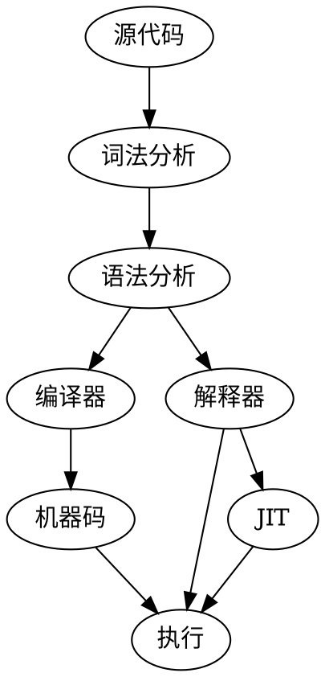

# stone-lang
两周自制编程语言源学习

## 目的
跟随《两周自制编程语言》的课程，学习如何进行简单的编译器制作。

## 读书笔记

### Chapter 01

+  源码到执行




### Chapter 02

+ 语法设计不能有二义性
    + dangling-else：多层if的情况下，无法确定else的归属。例如对于下列代码，如果不指定按照缩减匹配，或者匹配最外层，那么其实两种解释都是可以的，产生了二义性。
     ```
     if x > 0 
         if y > 0 
            do something;
     else
         do another thing;
     ```

### Chapter 03

+ Token类型
    + 标识符
        + 变量名
        + 函数名
        + 类名
        + 保留字
        + 运算符、括号
    + 数字
    + 字符串

+ 使用正则表达式来进行Token识别

| Token类型 |                          正则表达式                           |                                     备注                                     |
| -------- | ----------------------------------------------------------- | ------------------------------------------------------------------------- |
| 数字      | [0-9]+                                                      | 由0-9构成的，最少出现异常；不支持非10进制；不支持小数和负数                         |
| 标识符    | [A-Z_a-z][A-Z_a-z0-9]* \|==\|<=\|>=\|&&\\\|\\\|\|\p{Punct} | 字母或_开头，字母或者数字；==，<=，>=，&&，\|\|等运算符；\p{Punct}表示任意一个运算符 |
| 字符串    | "(\\"\|\\\\\\\\\|\\\\n\|[^"])\*"                            | "开头和结尾，包含\\",  \\\\，\\n，以及任意部署\"的字符                            |
| 空格      | \s*                                                         | 匹配空格                                                                      |
| 注释      | //.*                                                        | 匹配//开头的注释                                                               |

+ 每个token按照如下进行解析

$$
P_{空格}((P_{注释})|(P_{数字})|(P_{字符串})|P_{标识符})?
$$

### Chapter 04

+ 抽象语法树（Abstract Syntax Tree，AST）
    + 一种用于表示程序结构的树形结构
    + 构造的过程叫做：语法分析
   
+ 例子：
    + 1 + 2 * 3的ast如下
    ```dot
    digraph c4_simple_ast {
      "+" -> 1
      "+" -> "*"
      "*" -> 2
      "*" -> 3
    }
    ```


+ 文法表示
    + [铁路图](https://baike.baidu.com/item/Railroad%20Diagram/19408270?fr=aladdin)
    + BNF
        + 终结符
        + 非终结符
        + 与正则的差异：以token为单位进行检查，而正则是基于字符

## 进度

|    日期     |   进度   |  备注   |
| ---------- | ------- | ------- |
| 2020.10.04 | ch01&02 | 开始学习 |
| 2020.10.05 | ch03&04 | 词法分析 |
| 2020.10.06 | |  |


