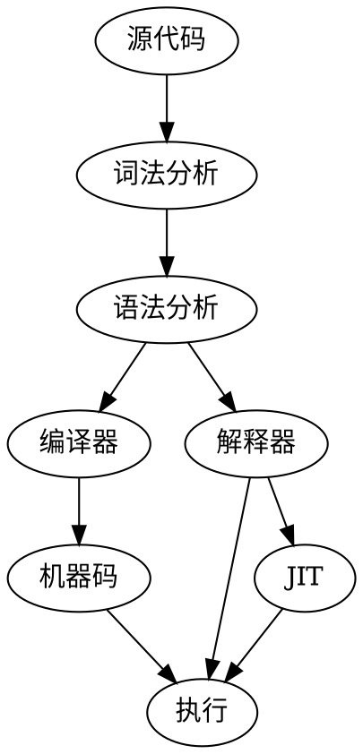

# stone-lang
两周自制编程语言源学习

## 目的
跟随《两周自制编程语言》的课程，学习如何进行简单的编译器制作。

## 读书笔记

### Chapter 01

+  源码到执行




### Chapter 02

+ 语法设计不能有二义性
    + dangling-else：多层if的情况下，无法确定else的归属。例如对于下列代码，如果不指定按照缩减匹配，或者匹配最外层，那么其实两种解释都是可以的，产生了二义性。
     ```
     if x > 0 
         if y > 0 
            do something;
     else
         do another thing;
     ```

### Chapter 03


## 进度

| 日期 | 进度 |  备注 |
| --- |--- |--- |
| 2020.10.04 |  | 开始学习 |


